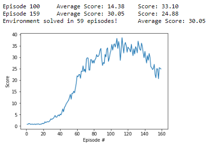

## Report

### Environment description

In this environment, a double-jointed arm can move to target locations. A reward of +0.1 is provided for each step that the agent's hand is in the goal location. Thus, the goal of your agent is to maintain its position at the target location for as many time steps as possible.

The observation space consists of 33 variables corresponding to position, rotation, velocity, and angular velocities of the arm. Each action is a vector with four numbers, corresponding to torque applicable to two joints. Every entry in the action vector should be a number between -1 and 1.

The task is episodic, and in order to solve the environment,  your agent must get an average score of +30 over 100 consecutive episodes.

### Learning Algorithm

I've used the Deep Deterministic Policy Gradients (DDPG) algorithm to train the double-jointed arm. The DDPG algorithm is an Actor-Critic method, which are at the intersection of value-based methods such as Deep Q-Learning, and policy-based methods such as REINFORCE.

As we have learned in the course, reinforcement learning is notoriously unstable when neural networks are used to represent the action values. Fortunately, we can address these instabilities by using two key features: Experience Replay and Fixed Q-Targets.

When the agent interacts with the environment, the sequence of experience tuples can be highly correlated. The naive learning algorithm that learns from each of these experience tuples in sequential order runs the risk of getting swayed by the effects of this correlation. By instead keeping track of a replay buffer and using experience replay to sample from the buffer at random, we can prevent action values from oscillating or diverging catastrophically. In this case, I've used a replay buffer that retains the 1,000,000 most recent experience tuples.

I've also used two separate networks with identical architectures for each of the actor and critic networks. This is referred to as Fixed Q-Targets. Without fixed Q-targets, we would encounter a harmful form of correlation, whereby we shift the parameters of the network based on a constantly moving target. The target Q-Network's weights are updated less often than the primary Q-Network. In this case, I update the target Q-Network's weights 10 times every 20 steps.

For the neural networks, I've chosen a 2-layer fully-connected architecture, each layer having 512 neurons. The input size is 33 for the state dimensions (position, rotation, velocity, and angular velocities of the arm) and it maps to 4 continuous outputs between -1 and 1 that represent the torque applicable to the two joints. The activation functions are RELUs. BatchNorm layers have been used for regularization.

The other hyperparameters I've used are:
* BATCH_SIZE = 128, the size of batches fed to the network while training
* GAMMA = 0.99, the discount factor 
* TAU = 1e-3, to soft-update of the target-networks weights
* LR_ACTOR = 1e-4, the learning rate of the actor network while training
* LR_CRITIC = 1e-4, the learning rate of the critic network while training
* WEIGHT_DECAY = 0, the L2 regularization weight decay

### Results

20 agents solved the environment (average score of +30 over 100 consecutive episodes) after approximately 60 episodes.

### Ideas for Future Work

* Tune hyperparameters
* Test different network achitectures
* Test different actor-critic methods like Asynchronous Advantage Actor-Critic (A3C), Advantage Actor-Critic (A2C) and Generalized Advantage Estimation (GAE)

